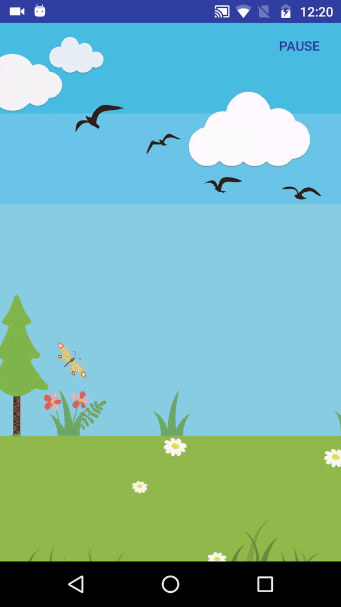

# Scrolling Images

An Android view for displaying repeated continuous side scrolling images. This can be used to create a parallax animation effect.

## Demo


## Usage
In your Android layout file add:
```xml
 <com.surbhi.scrollingimageslibrary.ScrollingImageView
        android:id="@+id/scrollView"
        android:layout_width="match_parent"
        android:layout_height="match_parent"
        app:speed="1.5dp"
        app:src="@array/day_imgs" />
```

There are two attributes for the `ScrollingImageView` namely `speed` and `src`.
* `speed` is the number of `dp`'s to move the bitmap on each animation frame (may be a negative number)
* `src` is the drawable to paint (**must be a bitmap or array of images!**)

Don't forget to add the namespace to your root XLM element
```xml
xmlns:app="http://schemas.android.com/apk/res-auto"
```

In your Java code, you can start and stop the animation like this:
```java
ScrollingImageView scrollingBackground = (ScrollingImageView) findViewById(R.id.scrollView);
scrollingBackground.stop();
scrollingBackground.start();
